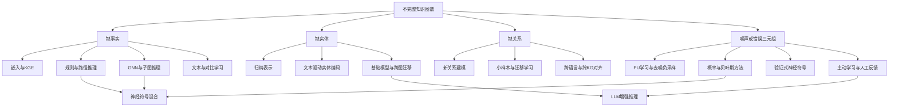

# 不完整知识图谱推理研究综述

## 执行摘要

过去几年里，**“在不完整知识图谱上进行推理”**已经从传统的静态链路预测，扩展到更现实的四类困难：**缺事实**、**缺关系**、**缺实体**，以及**噪声/错误三元组**。相应地，研究范式也从单一的嵌入学习，演化为**规则学习、路径推理、图神经网络、神经符号混合、概率/贝叶斯建模、主动补全、跨图迁移、以及近期的基础模型与LLM增强推理**等并行路线。中文综述《面向知识图谱的知识补全方法综述》也明确指出，近年的核心增量主要来自图神经网络、语言模型、强化/交互式补全等方向，而英文领域综述则强调神经符号与任务导向推理正在成为新的主线。citeturn14search4turn28view2turn0search10turn13search11

如果只看“能否在标准静态基准上拿高分”，**NBFNet、PUDA、SimKGC、RNNLogic**分别代表了GNN、去噪增强、文本对比学习、以及规则学习这几条强主线；如果更关注**新实体/新关系**，则**GraIL、NodePiece、InGram、ULTRA**更重要；如果更关注**噪声/不确定性**，则**BEUrRE、PUDA、DeMix、BIKG**更有代表性。对工业场景而言，没有任何单一路线能同时解决全部不完整性：**稠密静态KG**通常偏向GNN/KGE，**稀疏或可解释场景**偏向规则/神经符号，**开放世界与跨图迁移**偏向文本、归纳表示和基础模型，**高噪声或高风险应用**则需要概率校准、人机协同与验证式补全。citeturn19view0turn35view0turn19view4turn19view5turn25search12turn25search9turn31search3

需要特别警惕的是，**基准本身会极大影响结论**。SIGMOD 2020 的再评估指出，早期FB15k/WN18等数据集存在严重泄漏与冗余；ACL 2021 的 InferWiki、EMNLP 2020 的 CoDEx、KR 2023 的 inferential benchmark、ILPC 2022、以及 2025–2026 面向不完整知识的 BRINK，都在持续推动研究从“记忆式补全”转向“真正的推理能力”评估。换言之，**比较不同论文分数时，先比“实验协议”再比分数**，比直接看MRR更重要。citeturn23search0turn23search4turn23search3turn23search6turn23search5turn30search2turn13search3turn13search10

本文的核心判断是：**2019–2026 年这条研究线最显著的趋势，不是某一类模型完全胜出，而是“从封闭世界的静态补全，走向开放世界、归纳式、去噪式、可解释与可验证的混合推理系统”**。2024 之后，ULTRA、MERRY、KoPA、MPIKGC、GraSP 等工作进一步把“跨图泛化、文本利用、LLM 结构增强、以及缺边鲁棒性”推向前台，但可比性与稳定复现性仍明显弱于经典静态KGC路线。citeturn31search3turn31search4turn10search6turn10search0turn13search0

## 问题边界与评测基线

知识图谱推理在这里主要指：给定已有三元组集合，预测**缺失的尾实体/头实体/关系**，或在更广义设置下推断**多跳可达事实、复杂逻辑结论、跨图迁移事实**，并在不完整甚至含噪的图上保持稳健。近年的工作逐渐把“不完整性”拆成四类：**缺事实**对应标准KGC/链路预测；**缺实体**对应归纳式KGC与开放世界推理；**缺关系**对应新关系、跨域关系与小样本关系学习；**噪声三元组**对应不确定KG、假负样本、抽取错误和置信度失配。citeturn28view2turn15view3turn15view7turn25search12turn12search6turn25search8

评测上，近五年最常见的仍是 **MRR、Hits@1/3/10、MR**，静态KGC通常采用**filtered ranking**；不确定KG常加上**AUC、置信度预测**；归纳/跨图设置则常使用**sampled ranking** 或仅报 **Hits@10**；多语言/跨图补全常对多语言子图做**平均MRR/平均Hits**。这意味着不同论文的数值**并不天然同表可比**。例如 SimKGC 在 WN18RR/FB15k-237 上使用 filtered ranking，而 GraIL 的原始 inductive 实验对每个正例仅与 50 个随机负例比较，InGram 的 NL-50 则是“已知关系/新关系”拆开评测，SS-AGA 的 E-PKG 又是跨语言平均结果。citeturn19view1turn19view2turn19view3turn19view7

更重要的是，基准本身在不断被“纠偏”。SIGMOD 2020 指出早期基准中的逆关系与重复关系会高估模型能力；EMNLP 2020 的 CoDEx 引入了更难、更可解释的 Wikidata/Wikipedia 抽取图；ACL 2021 的 InferWiki 保证测试样本在训练图中**有支持性证据**；KR 2023 又进一步指出很多“inferential benchmark”仍未真正隔离规则诱导能力；ILPC 2022 则把注意力拉向真正的**inductive LP**；2025–2026 的 BRINK 把“缺失直接支撑事实后的推理能力”作为 KG-RAG / KGQA 的新鲁棒性测试。citeturn23search0turn23search6turn23search3turn23search5turn30search2turn13search3turn13search10

在数据选择上，本文将结果优先分为三种设置来看。第一类是**静态转导式**：FB15k-237、WN18RR、CoDEx、ogbl-wikikg2。第二类是**归纳/半归纳式**：Wikidata5M-Ind、ILPC 2022、NL-50 / NL-100、Wikidata5M-SI。第三类是**任务扩展型**：多语言KGC、复杂逻辑/不确定KG、以及 2025–2026 的不完整知识 KGQA / KG-RAG。这个分层有助于避免把“补全一个已有边”与“推断全新关系/全新实体”混为一谈。citeturn30search0turn30search1turn30search2turn30search4turn23search6turn23search3turn13search3

下面这张方法关系图，可以把“面对哪种不完整性时更适合优先考虑哪类方法”的主线先看清楚。其逻辑并非严格分类学，而是研究实践中的常见选择顺序。相关分类也与近年中文综述和英文教程式综述基本一致。citeturn28view2turn5search11turn13search11

## 方法谱系与代表工作

### 方法类别与代表工作对照表

| 方法类别 | 代表工作 | 主要解决的不完整性 | 典型机制 | 适用条件 |
|---|---|---|---|---|
| 基于嵌入的补全 | **CompGCN**、**NodePiece**、**BytE** citeturn25search14turn4search22turn4search2 | 缺事实、长尾实体、部分新实体 | 学习实体/关系低维表示；用组合函数、锚点分词、子词编码减少稀疏与OOV问题 | 图结构相对稳定、需要高吞吐推断 |
| 规则/逻辑推理 | **AnyBURL**、**RNNLogic**、**LatentLogic** citeturn5search12turn35view0turn21search2 | 缺事实、稀疏图、需解释 | Horn rule/链式规则学习；EM、概率后验、潜空间生成规则 | 关系规则较稳定、解释性重要 |
| 基于规则/路径推理 | **GraIL**、**CBR**、**OPRL** citeturn15view1turn5search4turn32view0 | 缺事实、缺实体、开放世界查询生成 | 抽取局部封闭子图、复用相似实体案例、从开放路径规则生成“该问什么问题” | 图稀疏、想保留路径证据、需要问询式补全 |
| 图神经网络 | **CompGCN**、**NBFNet**、**RED-GNN**、**KGCF** citeturn25search14turn39view3turn17view3turn7search1 | 缺事实、长路径依赖、关系组合 | 关系感知消息传递、Bellman-Ford 神经化、对反事实邻域做增强 | 有足够图结构、可接受训练成本 |
| 神经符号混合 | **RNNLogic**、**RulE**、**VANILLA/Poderoso** citeturn35view0turn21search8turn27search2turn27search7 | 缺事实、噪声、需验证性 | 嵌入分数与规则置信度融合；以约束、验证器或规则嵌入校验候选三元组 | 高风险或需要可解释验证 |
| 概率/贝叶斯/不确定推理 | **BEUrRE**、**BIKG**、**NPLL** citeturn25search12turn7search5turn22search2 | 噪声三元组、置信度缺失、复杂证据融合 | 概率盒嵌入、MRF/Bayesian inference、MLN+变分推断 | 医疗/金融等需不确定性刻画场景 |
| 主动学习/交互式补全 | **OPRL/Active KGC**、**AL for KG Accuracy** citeturn32view0turn8search2 | 缺实体、缺关系、系统“不知道自己不知道什么” | 先识别高价值缺口，再生成外部查询/人工校验任务 | 有人工标注或外部检索资源 |
| 数据增强/自监督 | **SimKGC**、**KGCF**、**MPIKGC** citeturn40view1turn7search1turn10search0 | 缺描述、缺边、长尾实体 | 对比学习、反事实增强、LLM扩写实体/关系语义 | 文本可得、希望增强长尾泛化 |
| 对抗训练/去噪采样 | **PUDA**、**DeMix**、**Refining Noisy KG with LLMs** citeturn12search6turn12search4turn10search1 | 假负样本、噪声关系、错误实体对齐 | PU 风险估计、混合式去噪负采样、LLM 纠错/校验 | 自动抽取图、噪声率较高 |
| 迁移学习/跨图学习/基础模型 | **SS-AGA**、**InGram**、**ULTRA**、**TransNet**、**MERRY** citeturn20search1turn11search12turn31search3turn9search4turn31search4 | 新实体、新关系、低资源语言、跨KG泛化 | 对齐边、自适应注意力、关系图聚合、预训练/零样本迁移 | 开放世界、跨域、跨语言、持续演化图 |

### 关键论文与方法细节总表

| 类别 | 论文 | 作者与年份 | 核心思想与模型架构 | 损失/训练策略 | 处理不完整性的具体机制 | 优点 | 局限 | 代码/数据 |
|---|---|---|---|---|---|---|---|---|
| 嵌入+GNN | **Composition-based Multi-Relational Graph Convolutional Networks** | Vashishth et al., 2020 citeturn36view0turn25search14 | 将关系嵌入显式纳入消息传递；节点更新为 `W·φ(h_u,h_r)` 的关系组合卷积；可与 TransE/DistMult/ConvE scorer 结合 citeturn36view0turn37view3 | 1-N scoring，交叉熵+label smoothing，Adam 训练 citeturn37view0 | 用关系组合降低稀疏关系的局部传播损失，对复杂关系更稳健 citeturn37view1turn37view3 | 参数效率高，兼容多种 scorer，实用性强 | 仍偏转导式，对全新关系/实体支持有限 | 代码：[CompGCN](https://github.com/malllabiisc/CompGCN) |
| 路径/子图归纳 | **Inductive Relation Prediction by Subgraph Reasoning** | Teru et al., 2020 citeturn15view1 | 抽取查询实体对周围的 enclosing subgraph，用关系标注与 attention 编码局部结构规则 citeturn15view1turn19view2 | 二分类/AUC-PR + sampled Hits@10，局部子图上训练 citeturn16view4turn19view2 | 不依赖全局实体 embedding，可在**未见实体**上做归纳推断 citeturn15view1 | 强归纳性，结构解释较清晰 | 计算随子图抽取和候选数增长，原文也指出转导大图可扩展性有限 citeturn19view0 | 代码：[GraIL](https://github.com/kkteru/grail) |
| 规则学习 | **RNNLogic: Learning Logic Rules for Reasoning on Knowledge Graphs** | Qu et al., 2021 citeturn35view0 | 把规则当作潜变量；RNN 规则生成器 + 规则推理器；以 EM 近似后验选高质量规则 citeturn33view0turn35view0 | E-step 选规则，M-step 同时更新生成器和推理器 citeturn33view0 | 通过规则后验缩小搜索空间，在稀疏图中比纯嵌入更稳健，且可解释 citeturn35view0 | 解释性强；在稀疏关系/稀疏数据上很有竞争力 | 规则空间仍大，对超长链规则和噪声规则敏感 | 代码：[RNNLogic](https://github.com/DeepGraphLearning/RNNLogic) |
| GNN+路径统一 | **Neural Bellman-Ford Networks** | Zhu et al., 2021/NeurIPS 2021 citeturn15view0turn31search3 | 将 Bellman-Ford 路径求解神经化为 **INDICATOR / MESSAGE / AGGREGATE** 三组件；本质上是 source-conditioned pair representation GNN citeturn38view2 | 最小化正/负三元组负对数似然；PCA 负采样；drop 直接边鼓励长路径推理 citeturn39view3 | 显式聚合多跳路径，对缺边更不脆弱；同时适配转导与归纳设置 citeturn39view3turn19view0 | 精度强、可解释、归纳性能好 | 训练和推断仍需较强图计算资源 | 代码：[NBFNet](https://github.com/DeepGraphLearning/NBFNet) |
| 不确定嵌入 | **Probabilistic Box Embeddings for Uncertain Knowledge Graph Reasoning** | Chen et al., 2021 citeturn25search12 | 实体表示为 box，关系为仿射变换；用体积/交集赋予概率语义与全局一致性 citeturn7search2turn25search12 | 学习三元组置信度与事实排序；强调概率校准 citeturn7search2 | 能同时刻画“不完整”与“三元组不确定性/冲突” citeturn7search2 | 适合 uncertain KG；概率解释自然 | 几何模型较复杂，对普通静态KGC未必总优 | 代码：[BEUrRE](https://github.com/stasl0217/beurre) |
| 对抗+PU | **Positive-Unlabeled Learning with Adversarial Data Augmentation for KGC** | Tang et al., 2022 citeturn12search6turn19view4 | 将 KGC 看成 PU 学习；用 adversarial augmentation 生成更有效训练样本 citeturn15view5 | PU 风险估计 + minimax 数据增强；可作为 plug-in 框架 citeturn15view5turn19view4 | 直接针对**假负样本**与**数据稀疏**两个不完整性核心问题 citeturn12search6 | 易插拔、提升稳定 | 强依赖负样本与 backbone 的实现细节 | 代码：[PUDA](https://github.com/HELL-TO-HEAVEN/PUDA) |
| 文本+自监督 | **SimKGC: Simple Contrastive KGC with Pre-trained Language Models** | Wang et al., 2022 citeturn15view2turn19view1 | 用 bi-encoder 编码实体/关系文本；通过 in-batch、pre-batch、self-negatives 做大规模对比学习 citeturn40view1turn40view2 | InfoNCE 为主；大量负样本；自负样本缓解头实体文本泄漏 citeturn40view0turn40view2 | 对**未见实体**和文本充分的长尾实体特别有效；能做 inductive KGC citeturn40view1turn19view1 | 开放世界友好；扩到 Wikidata5M 很自然 | 图结构利用较弱，在纯结构强约束数据上未必占优 | 代码：[SimKGC](https://github.com/intfloat/SimKGC) |
| 跨图/跨语言 | **Multilingual KGC with Self-Supervised Adaptive Graph Alignment** | Huang et al., 2022 citeturn20search1turn19view7 | 把 seed alignment 当新边类型，把多语言 KG 融成一张图；用 relation-aware attention 控制跨图信息传播，并动态生成新对齐对 citeturn15view7turn20search1 | KGC loss + self-supervised alignment 生成/筛选 citeturn19view7 | 用跨语言迁移弥补低资源语言的**缺事实+缺实体链接**问题 citeturn20search1 | 对低资源语言有效，实际 E-commerce KG 有用 | 依赖 seed alignment，且会引入对齐噪声 | 代码：[SS-AGA](https://github.com/amzn/ss-aga-kgc) |
| 去噪负采样 | **Negative Sampling with Adaptive Denoising Mixup for KGE** | Chen et al., 2023 citeturn12search4turn19view5turn19view6 | 将高分未标注负例拆成 pseudo-negative / harder negative，再 mixup 合成更干净更难的训练样本 citeturn12search4 | 自监督去噪 + mixup + Self-Adv 负采样兼容 citeturn19view5turn19view6 | 直接缓解 incomplete KG 中普遍存在的**false negative** citeturn12search4 | 插件式、和 RotatE/HAKE/ComplEx 等兼容 | 仍依赖 backbone；对某些稀疏集提升有限 | 代码：[DeMix](https://github.com/DeMix2023/Demix) |
| 新关系归纳 | **InGram: Inductive Knowledge Graph Embedding via Relation Graphs** | Lee et al., 2023 citeturn15view3turn11search12 | 额外构造 relation graph，用关系级与实体级 attention 聚合，生成**新关系+新实体**的嵌入 citeturn15view3turn19view3 | 归纳 link prediction；在 known/new relation 子集分别评测 citeturn18view3 | 解决很多 inductive KGC 方法“不支持未见关系”的缺点 citeturn15view3 | 对开放世界、增量关系特别重要 | 若已知关系规则非常强，可能未必比专门记忆型模型更优 citeturn19view3 | 代码：[InGram](https://github.com/bdi-lab/InGram) |
| 因果增强 | **Knowledge Graph Completion with Counterfactual Augmentation** | Chang et al., 2023 citeturn7search1turn11search5 | 把实体对表示视为 context、关系邻域视为 treatment、三元组真值视为 outcome，生成 counterfactual relations 做增强 citeturn7search0turn7search10 | 反事实数据增强与 GNN 联训 citeturn7search0 | 面向关系分布不均与结构缺边，提升鲁棒性和可解释路径分析 citeturn7search10 | 思想新颖，解释性较好 | 可公开复现实验资源不如主流开源框架充分 | 代码：未检索到稳定官方仓库 |
| 潜空间规则 | **LATENTLOGIC: Learning Logic Rules in Latent Space over KGs** | Liu et al., 2023 citeturn21search2 | 用预训练 VAE 把离散关系路径映到潜空间，再以 energy-based distribution + ODE sampler 生成规则 citeturn21search2turn21search10 | 生成式规则挖掘，缓解枚举与强化学习优化难题 citeturn21search10 | 在大规则空间中更高效地找高质量规则 | 规则质量受潜空间学习质量影响 | 代码：未检索到稳定官方仓库 |
| 贝叶斯复杂证据 | **Bayesian Inference with Complex Knowledge Graph Evidence** | Toroghi & Sanner, 2024 citeturn7search5turn25search1 | 构建对应复杂逻辑证据的 MRF，以 MPE / marginal quantifier 闭式推断多路径证据 citeturn25search9 | Bayesian closed-form inference | 面向复杂逻辑证据与不确定结论，更适合高风险应用 citeturn7search5 | 置信度表达清楚，适合复杂证据融合 | 规模化门槛高于普通 KGE | 代码：[BIKG](https://github.com/atoroghi/BIKG) |
| 迁移/基础模型 | **ULTRA: Towards Foundation Models for Knowledge Graph Reasoning** | Galkin et al., 2024 | 单一预训练模型跨任意 KG、任意关系词表做 0-shot/finetune 推理；关系表示被建模为条件函数而非固定表 citeturn31search0turn31search3turn31search5 | 多图预训练；跨 50+ KG 泛化 citeturn31search2 | 直接缓解开放世界、跨图迁移和新关系泛化难题 | 代表“KG foundation model”方向 | 训练成本高；解释性弱于规则法 | 代码：[ULTRA](https://github.com/DeepGraphLearning/ULTRA) |
| 多视角LLM增强 | **Multi-perspective Improvement of KGC with LLMs** | Xu et al., 2024 | 通过 LLM 的 reasoning / explanation / summarization 能力扩写实体描述、理解关系、抽取结构信号，增强 description-based KGC citeturn10search0turn10search4 | 把 LLM 作为数据增强器与结构补充器 citeturn10search0 | 尤其适合长尾实体、描述稀疏和上下文不足情况 | 文本资源利用强，易迁移到企业长尾 | 依赖外部LLM，实验协议差异大 | 代码：[MPIKGC](https://github.com/quqxui/MPIKGC) |
| 主动补全 | **Active Knowledge Graph Completion** | Omran et al., 2020/2022 citeturn32view0turn8search6 | 提出 Open Path Rules；不是直接补全三元组，而是先生成“值得问”的查询，再交给人工/外部系统回答 citeturn32view0 | 用 OPSC/OPHC 评估 OP 规则质量，生成外部查询任务 citeturn32view0 | 能处理“KG 不知道自己不知道什么”，还能引入新实体 citeturn32view0 | 非常适合人机协作式知识修复 | 不是端到端自动补全；依赖后续问答/标注流程 | 论文给出补充数据链接，未见成熟统一代码仓库 |
| 跨图/通用推理 | **MERRY: A Foundation Model for General KG Reasoning** | Hua et al., 2025 | 面向 in-KG 与 out-of-KG 两类任务，联合结构与文本，做更一般的 KG reasoning foundation model citeturn31search4turn31search11 | 多视角条件消息传递 + 多任务训练 | 进一步把“补全”扩成“通用推理” | 更贴近未来统一系统 | 2025 新工作，独立复现与系统化基准还少 | 代码：[MERRY](https://github.com/zjukg/MERRY) |

从这张表可以看出，一个非常清晰的分工已经形成。**缺事实**主要还是 KGE/GNN/规则方法的主战场；**缺实体/缺关系**越来越依赖文本、归纳表示、迁移学习和基础模型；**噪声三元组**则把研究重点从单纯“补”转向“补+校准+验证”。2024 以后，LLM 与 foundation-model 工作显著增多，但它们更多像是把已有路线做了**跨图泛化**或**外部知识放大**，而不是彻底替代传统KG推理。citeturn31search3turn31search4turn10search0turn10search6

## 性能比较与可复现性

下面这张表只放入**实验协议足够接近**的结果，或清楚注明“协议不同，仅供趋势参考”。静态 FB15k-237 / WN18RR 的行，大体都使用 filtered ranking，因此可以横向看；归纳与跨图行则必须只做**同设置内部**比较，不能和静态分数直接对比。citeturn19view0turn19view1turn19view3turn19view7

### 性能比较表

| 设置 | 方法 | FB15k-237 | WN18RR | 归纳/跨图结果 | 可复现性评估 | 备注 |
|---|---|---:|---:|---|---|---|
| 静态转导 | RotatE | MRR 0.338 / H@10 0.553 citeturn19view1turn19view0 | MRR 0.476 / H@10 0.571 citeturn19view1turn19view0 | — | 高。官方实现成熟，常作强基线。citeturn11search3 | 代表强KGE基线 |
| 静态转导 | RNNLogic with emb. | MRR 0.344 / H@10 0.530 citeturn35view0 | MRR 0.483 / H@10 0.558 citeturn35view0 | — | 中高。官方代码可用，但规则搜索/EM对环境较敏感。citeturn21search3 | 解释性强 |
| 静态转导 | PUDA | MRR 0.369 / H@10 0.578 citeturn19view4 | MRR 0.481 / H@10 0.582 citeturn19view4 | — | 中。演示实现可得，但作为 plug-in 与 backbone 耦合。citeturn12search12 | 重点解决 false negatives |
| 静态转导 | SimKGC IB+PB+SN | MRR 0.336 / H@10 0.511 citeturn19view1 | MRR 0.666 / H@10 0.800 citeturn19view1 | Wikidata5M-Ind：MRR 0.714 / H@10 0.917（同表百分比换算）citeturn19view1 | 高。代码完整，数据下载与预处理脚本齐全。citeturn30search8 | 文本强，FB15k-237 上受“可预测性上限”影响较大 citeturn40view2 |
| 静态转导 | NBFNet | MRR 0.415 / H@10 0.599 citeturn19view0turn39view3 | MRR 0.551 / H@10 0.666 citeturn19view0turn39view3 | FB15k-237-ind v1–v4 H@10 = 0.834/0.949/0.951/0.960；WN18RR-ind v1–v4 H@10 = 0.948/0.905/0.893/0.890 citeturn19view0 | 高。官方代码成熟，但依赖 TorchDrug 环境。citeturn24search2 | 当前最稳健的 GNN 路线之一 |
| 半归纳新关系 | GraIL | — | — | NL-50：known MRR 0.264 / H@10 0.389；new MRR 0.082 / H@10 0.209 citeturn18view3turn19view3 | 高。官方代码可用。citeturn25search3 | 适合未见实体，但新关系更难 |
| 半归纳新关系 | InGram | — | — | NL-50：known MRR 0.330 / H@10 0.481；new MRR 0.244 / H@10 0.430 citeturn18view3turn19view3 | 高。官方代码齐全。citeturn11search0 | 对“未见关系”最有代表性 |
| 多语言跨图 | SS-AGA | — | — | E-PKG 平均：MRR 0.384，优于 AlignKGC 的 0.373（平均）citeturn19view7 | 高。官方代码与数据均开放。citeturn20search0turn20search8 | 适合跨语言低资源 KG |
| 噪声去采样 | DeMix-Adv on RotatE | MRR 0.329 / H@10 0.518 citeturn19view5 | MRR 0.479 / H@10 0.576 citeturn19view5 | — | 中高。官方代码开放。citeturn12search2 | 和 backbone 绑定，宜看“相对增益”不是绝对值 |
| 不确定KG | BEUrRE | 原文重心为 confidence prediction / fact ranking，和静态KGC常规 MRR 协议不完全一致 citeturn25search12turn7search2 | 同左 | — | 中高。官方仓库可用。citeturn25search0 | 更适合 uncertain KG，不宜与普通 KGC 直接拼表 |

从结果趋势看，有三点很稳定。第一，**如果数据是标准静态KG且目标是高精度链路预测，NBFNet 这类“路径/GNN统一”模型仍是非常强的默认选项**；第二，**如果存在明显假负样本或抽取噪声，PUDA/DeMix 这类训练层去噪的收益非常直接**；第三，**如果问题本质是开放世界或未见实体/关系，单纯转导KGE几乎不再是合理默认值，GraIL、SimKGC、InGram、ULTRA 才是更合适的起点**。citeturn39view3turn19view4turn19view5turn19view3turn19view1turn31search3

复现上，最稳的资源通常来自**官方 GitHub + 标准数据脚本**。CompGCN、GraIL、RNNLogic、NBFNet、InGram、SimKGC、SS-AGA、PUDA、DeMix、BEUrRE、BIKG、ULTRA 都能找到作者仓库或官方实现说明；相比之下，**KGCF、部分 2024–2026 神经符号或 LLM 增强工作**的公开实现和基准脚本还不够统一，因此更适合做“趋势吸收”，而不适合立刻作为工业默认方案。citeturn25search2turn25search3turn21search3turn24search2turn11search0turn20search0turn12search12turn12search2turn25search0turn25search1turn31search2

## 适用场景、局限与未来方向

在**搜索、推荐、企业主数据、广告图谱**这类高吞吐静态图场景中，最常见的目标仍然是“给定实体和关系，快速补齐缺失尾实体”。这时优先级通常是：**NBFNet / CompGCN 类 GNN**，或者高质量 KGE 基线再加上 **PUDA / DeMix** 的去噪训练。如果图非常大、关系词表比较稳定，还可先用 PyKEEN / DGL-KE 做大范围基线，再对长尾关系切换到更强的结构模型。citeturn39view3turn37view3turn19view4turn19view5turn24search0turn24search1

在**医疗、生物、金融风控、科学知识库**中，单纯“是否预测对”往往不够，系统还要回答“为什么预测对”“置信度是否可信”“是否违反约束”。这类场景更适合**RNNLogic/AnyBURL/LatentLogic**等规则路线，或 **BEUrRE、BIKG、VANILLA/Poderoso** 这类概率/验证式神经符号系统。它们往往不追求所有公开基准上的绝对最高MRR，但更符合高风险应用对**可解释、可验证、可校准**的要求。citeturn35view0turn5search16turn21search2turn25search12turn25search9turn27search2turn27search7

在**开放世界、持续演化图、低资源语言或新业务上线**的环境中，问题的本质往往不是“图中哪条边漏了”，而是“**图中根本还没有这个实体/关系/语言片段**”。此时归纳式文本方法和迁移方法更重要：**SimKGC** 用文本把未见实体编码出来，**SS-AGA** 用跨语言对齐转移知识，**InGram** 把“未见关系”也纳入归纳范围，**ULTRA/MERRY** 则进一步把“跨图泛化”做成 foundation model 目标。citeturn19view1turn20search1turn15view3turn31search3turn31search4

如果你的系统已经进入了**知识修复闭环**而不是单次离线补全，那么主动式方法的价值会被放大。OPRL/Active KGC 的启发非常重要：很多时候系统失败不是因为缺少一个 scorer，而是因为系统**不知道应该向人类或外部检索提出哪些问题**。因此未来更实际的方向，往往是“**规则发现高价值缺口 → LLM/检索生成候选 → 人工或验证器过滤 → 反馈回图谱**”的闭环，而不是一次性全自动补全。citeturn32view0turn8search2

未来研究方向，我认为有六条最值得跟进。其一是**面向新实体/新关系/新图的统一归纳推理**，ULTRA、MERRY、KG-ICL 等已经朝这个方向走，但还缺统一评测；其二是**噪声感知与置信度校准**，尤其是从信息抽取构图得到的自动KG；其三是**神经符号验证层**，即让预测不只是“高分”，而是“通过类型、功能、约束、因果一致性验证”；其四是**benchmark 从静态链路预测向真正的缺知识推理迁移**，BRINK、InferWiki、ILPC 等只是开始；其五是**LLM 不再只做文本外挂，而是与图结构形成可控协同**，如 KoPA、MPIKGC、GraSP 这类结构增强路线；其六是**可复现性与工程化标准化**，包括统一数据拆分、统一负采样协议、统一候选集规模和更完善的官方代码。citeturn31search3turn31search4turn13search10turn23search3turn30search2turn10search6turn10search0turn13search0

## 开源代码与数据集清单

下面这张表把“最值得直接上手的开源资源”合并列出，优先选择**官方代码仓库**和**官方数据主页/仓库**。表中资源既包括模型，也包括更适合做评测的基准与工具库。

| 类型 | 资源 | 适用任务 | 链接 | 备注 |
|---|---|---|---|---|
| 代码 | CompGCN | 静态 KGC / 多关系 GNN | [GitHub](https://github.com/malllabiisc/CompGCN) | ICLR 2020 官方实现。citeturn25search2 |
| 代码 | GraIL | 归纳式子图推理 | [GitHub](https://github.com/kkteru/grail) | ICML 2020 官方实现。citeturn25search3 |
| 代码 | RNNLogic | 规则学习 / 可解释推理 | [GitHub](https://github.com/DeepGraphLearning/RNNLogic) | 官方实现，含 FB15k-237 / WN18RR 数据说明。citeturn21search3turn26search1 |
| 代码 | NodePiece | 长尾/归纳实体表示 | [GitHub](https://github.com/migalkin/NodePiece) | ICLR 2022 官方仓库。citeturn4search13 |
| 代码 | InGram | 未见关系 + 未见实体归纳补全 | [GitHub](https://github.com/bdi-lab/InGram) | ICML 2023 官方实现。citeturn11search0 |
| 代码 | NBFNet | 多跳路径/GNN统一推理 | [GitHub](https://github.com/DeepGraphLearning/NBFNet) | NeurIPS 2021 官方实现。citeturn24search2 |
| 代码 | SimKGC | 文本驱动 inductive KGC | [GitHub](https://github.com/intfloat/SimKGC) | 含 Wikidata5M 下载脚本。citeturn30search8 |
| 代码 | SS-AGA | 多语言/跨图 KGC | [GitHub](https://github.com/amzn/ss-aga-kgc) | ACL 2022 官方实现与数据。citeturn20search0turn20search8 |
| 代码 | PUDA | 去假负样本 + 对抗增强 | [GitHub](https://github.com/HELL-TO-HEAVEN/PUDA) | IJCAI 2022 官方演示实现。citeturn12search12 |
| 代码 | DeMix | 去噪负采样 / mixup | [GitHub](https://github.com/DeMix2023/Demix) | ISWC 2023 官方实现。citeturn12search2 |
| 代码 | BEUrRE | uncertain KG / 概率盒嵌入 | [GitHub](https://github.com/stasl0217/beurre) | NAACL 2021 官方资源。citeturn25search0 |
| 代码 | BIKG | 贝叶斯复杂证据推理 | [GitHub](https://github.com/atoroghi/BIKG) | AAAI 2024 官方实现。citeturn25search1 |
| 代码 | ULTRA | KG foundation model / 零样本迁移 | [GitHub](https://github.com/DeepGraphLearning/ULTRA) | ICLR 2024 官方实现。citeturn31search2 |
| 代码 | MERRY | 通用KG foundation model | [GitHub](https://github.com/zjukg/MERRY) | ACL Findings 2025 官方实现。citeturn31search6 |
| 工具库 | PyKEEN | 快速搭基线、超参搜索、数据集管理 | [GitHub](https://github.com/pykeen/pykeen) / [Docs](https://pykeen.readthedocs.io/) | 复现静态KGE首选。citeturn24search0turn24search4 |
| 工具库 | DGL-KE | 大规模 KGE 训练 | [GitHub](https://github.com/awslabs/dgl-ke) / [Docs](https://aws-dglke.readthedocs.io/) | 适合工业规模图。citeturn24search5turn24search1 |
| 数据集 | FB15k-237 / WN18RR | 静态转导 KGC 基线 | 可经 [PyKEEN](https://pykeen.readthedocs.io/) 直接拉取 | 仍是最常用起点，但需警惕其推理上限。citeturn24search4turn23search3 |
| 数据集 | CoDEx | 更难的静态 KGC | [GitHub](https://github.com/tsafavi/codex) | 含 hard negatives，更接近真实难度。citeturn23search6turn23search18 |
| 数据集 | InferWiki | 规则可推断 benchmark | [GitHub](https://github.com/TaoMiner/inferwiki) | 更适合测“真推理”。citeturn23search3turn23search7 |
| 数据集 | Wikidata5M | 大规模文本+图补全 | [主页](https://deepgraphlearning.github.io/project/wikidata5m) | 适合 inductive / text-rich KGC。citeturn30search1 |
| 数据集 | ILPC 2022 | 归纳式链接预测 | [GitHub](https://github.com/pykeen/ilpc2022) | 目前较标准的 inductive LP challenge。citeturn30search2turn30search12 |
| 数据集 | Wikidata5M-SI | 半归纳链接预测 | [GitHub](https://github.com/uma-pi1/wikidata5m-si) | 专门测半归纳 setting。citeturn30search4 |
| 数据集 | ogbl-wikikg2 | 大规模现实链路预测 | [OGB](https://snap-stanford.github.io/ogb-web/docs/linkprop/) | 适合看规模化与 Hits@100。citeturn30search0 |
| 数据集 | BRINK | 不完整知识下 KG-RAG / KGQA 鲁棒性 | [GitHub](https://github.com/boschresearch/brink) | 2025–2026 非常值得关注的新基准。citeturn13search10turn13search3 |

如果要从零开始做一个**可复现研究流水线**，最稳妥的顺序通常是：**PyKEEN/DGL-KE 建立 KGE 基线 → NBFNet / GraIL / InGram 做结构与归纳增强 → PUDA/DeMix 做训练去噪 → CoDEx / InferWiki / ILPC / BRINK 做更真实评测**。如果文本丰富，再并入 SimKGC 或 MPIKGC；如果强调跨图统一与长期演化，再加 ULTRA / MERRY。这个组合，基本覆盖了 2019–2026 这条研究线的主干。citeturn24search0turn24search1turn24search2turn11search0turn12search12turn12search2turn23search18turn23search7turn30search2turn13search10turn30search8turn10search16turn31search2turn31search6